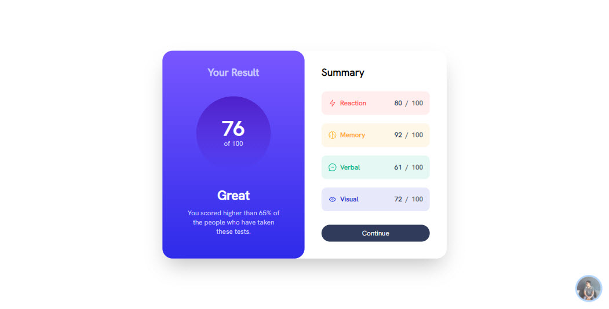
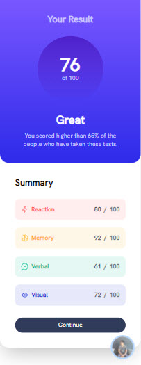

<div id="top"></div>

<div align="center">
  

  <h2 align="center">Result summary component solution</h2>
  <p align="center">
    <a href="https://www.frontendmentor.io/challenges/results-summary-component-CE_K6s0maV"><strong>Frontend Mentor Challenge</strong></a>
    <br />
    <br />
    <!-- <a href="https://article-preview-component-hdez.vercel.app/">View Demo</a>
    · -->
    <a href="https://github.com/MelvinAguilar/article-preview-component/issues" target="_blank">Report Bug</a>
    ·
    <a href="https://github.com/MelvinAguilar/article-preview-component/issues" target="_blank">Request Feature</a>
  </p>
</div>

<!-- Bagdes -->
<div align="center">
  <!-- Profile -->
  <a href="https://www.frontendmentor.io/profile/MelvinAguilar">
    
  </a>
  <!-- Status -->
    <a href="#">
    
  </a>
</div>

#

<div align="center">


</div>

This is a solution to the [Results summary component challenge on Frontend Mentor](https://www.frontendmentor.io/challenges/results-summary-component-CE_K6s0maV). Frontend Mentor challenges help you improve your coding skills by building realistic projects.

<h2 align="left">Links</h2>

<!-- - Solution URL: [Results summary component (Sveltekit + Tailwind CSS) | Frontend Mentor](https://www.frontendmentor.io/solutions/article-preview-component-tailwind-css-javascript-Z0Z01zbyl6)
- Live Site URL: [https://article-preview-component-hdez.vercel.app/](https://article-preview-component-hdez.vercel.app/) -->

<br>

## Table of contents

- [Overview](#overview)
  - [The challenge](#the-challenge)
  - [Screenshot](#screenshot)
- [My process](#my-process)
  - [Built with](#built-with)
- [Author](#author)
- [Acknowledgments](#acknowledgments)

## Overview

### The challenge

Users should be able to:

- View the optimal layout for the interface depending on their device's screen size
- See hover and focus states for all interactive elements on the page

### Screenshot





## My process

### Built with

<!-- Bagdes -->


- Sveltekit
- Tailwind CSS
- Semantic HTML5 markup

### Useful resources

- [Svelte](https://svelte.dev/)
- [Sveltekit](https://kit.svelte.dev/)
- [Tailwind CSS](https://tailwindcss.com/)

## Author

- <svg role="img" width="20" viewBox="0 0 24 24" xmlns="http://www.w3.org/2000/svg"><title>GitHub</title><path fill="#fff" d="M12 .297c-6.63 0-12 5.373-12 12 0 5.303 3.438 9.8 8.205 11.385.6.113.82-.258.82-.577 0-.285-.01-1.04-.015-2.04-3.338.724-4.042-1.61-4.042-1.61C4.422 18.07 3.633 17.7 3.633 17.7c-1.087-.744.084-.729.084-.729 1.205.084 1.838 1.236 1.838 1.236 1.07 1.835 2.809 1.305 3.495.998.108-.776.417-1.305.76-1.605-2.665-.3-5.466-1.332-5.466-5.93 0-1.31.465-2.38 1.235-3.22-.135-.303-.54-1.523.105-3.176 0 0 1.005-.322 3.3 1.23.96-.267 1.98-.399 3-.405 1.02.006 2.04.138 3 .405 2.28-1.552 3.285-1.23 3.285-1.23.645 1.653.24 2.873.12 3.176.765.84 1.23 1.91 1.23 3.22 0 4.61-2.805 5.625-5.475 5.92.42.36.81 1.096.81 2.22 0 1.606-.015 2.896-.015 3.286 0 .315.21.69.825.57C20.565 22.092 24 17.592 24 12.297c0-6.627-5.373-12-12-12"/></svg> Github - [Nutchapon](https://github.com/kodaicoder)
- <svg role="img" width="20" viewBox="0 0 24 24" xmlns="http://www.w3.org/2000/svg"><title>Twitter</title><path  fill="#fff" d="M23.953 4.57a10 10 0 01-2.825.775 4.958 4.958 0 002.163-2.723c-.951.555-2.005.959-3.127 1.184a4.92 4.92 0 00-8.384 4.482C7.69 8.095 4.067 6.13 1.64 3.162a4.822 4.822 0 00-.666 2.475c0 1.71.87 3.213 2.188 4.096a4.904 4.904 0 01-2.228-.616v.06a4.923 4.923 0 003.946 4.827 4.996 4.996 0 01-2.212.085 4.936 4.936 0 004.604 3.417 9.867 9.867 0 01-6.102 2.105c-.39 0-.779-.023-1.17-.067a13.995 13.995 0 007.557 2.209c9.053 0 13.998-7.496 13.998-13.985 0-.21 0-.42-.015-.63A9.935 9.935 0 0024 4.59z"/></svg> Twitter - [@SolanianNut](https://twitter.com/SolanianNut)
- <svg role="img" width="20" viewBox="0 0 24 24" xmlns="http://www.w3.org/2000/svg"><title>Frontend Mentor</title><path fill="#fff" d="M12.1706 1.2719a.732.732 0 00-.7186.732v13.914a.732.732 0 00.732.732.732.732 0 00.7318-.732V2.004a.732.732 0 00-.7452-.732zm11.0741 4.1685a.7339.7339 0 00-.2764.063L16.686 8.307a.7329.7329 0 000 1.3361l6.2823 2.8134a.7378.7378 0 00.2993.0648.732.732 0 00.2973-1.401l-4.786-2.1443 4.786-2.1366a.7339.7339 0 00.3698-.9664.7339.7339 0 00-.69-.4327zm-22.499 5.032a.7316.7316 0 00-.7223.9149c1.736 6.677 7.7748 11.341 14.6822 11.341a.732.732 0 000-1.464 13.7055 13.7055 0 01-13.266-10.2449.7316.7316 0 00-.6939-.547z"/></svg> Frontend Mentor - [@NutchaponMake](https://www.frontendmentor.io/profile/NutchaponMake)

## Acknowledgments

### Run the project

To run the client, you need to run the following command:

```bash
npm install
npm run dev
//or//
npx vite
```
